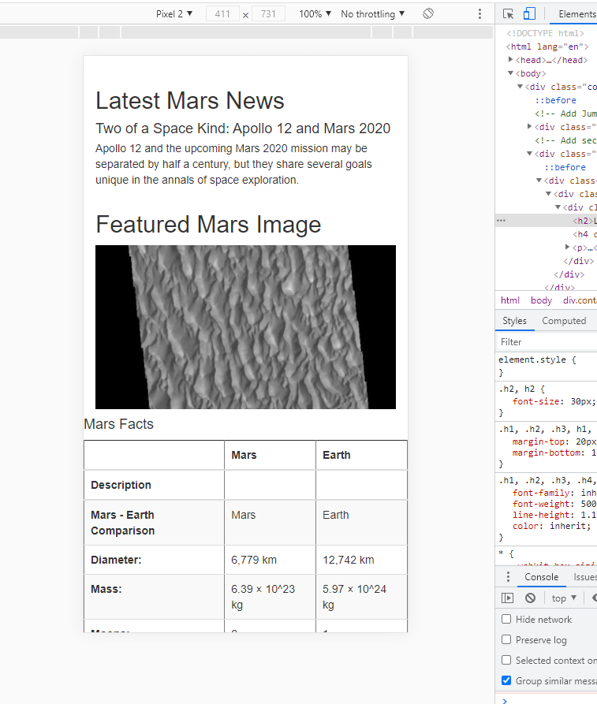

# Mission to Mars - Web Scraping 

## Contents
- [Overview of the Project](#overview)
- [Files](#files)
- [Notes](#notes) 

## Overview
The purpose of this challenge is to add details to the Mars webpage and ensure that the page is mobile-responsive. Some other styling also elements have been modified to personalize and potentially clean up the webpage.

## Files
- Mission_to_Mars_Challenge.ipynb  - Jupyter notebook web scraping code
- Mission_to_Mars_Challenge.py - Python code with web scraping functions
- app.py - Flask routes
- templates\index.html - Contains Bootstrap cpmponents, modified styling for buttons and a different layout for the hemisphere thumbnails
- Resources\ - Contains screen captures showing mobile-responsiveness of webpage

## Notes
#### Deliverable 3
- The third deliverable involved testing the mobile-responsiveness of the page and update it if necessary. the nature of the code already present in the index file makes the page responsive to mobile and other devices as shown below:

